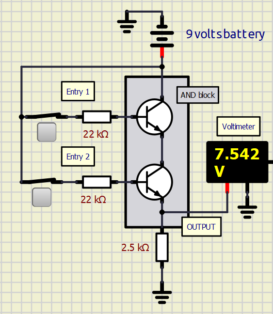
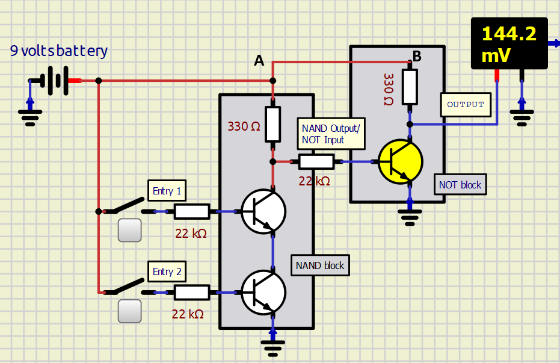
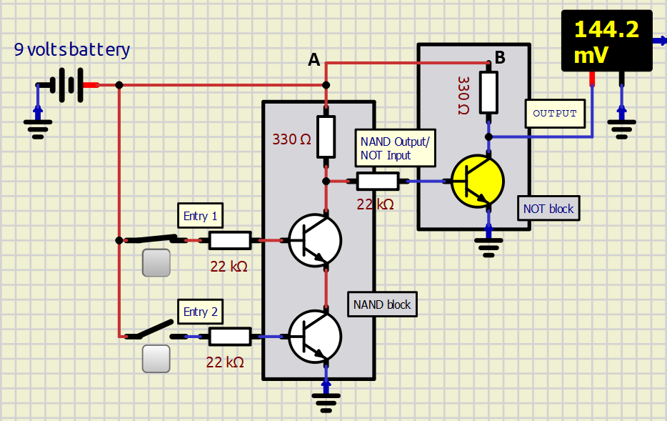
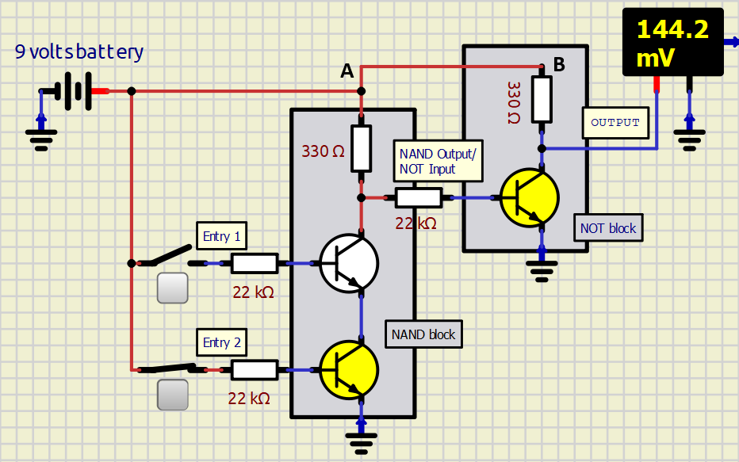
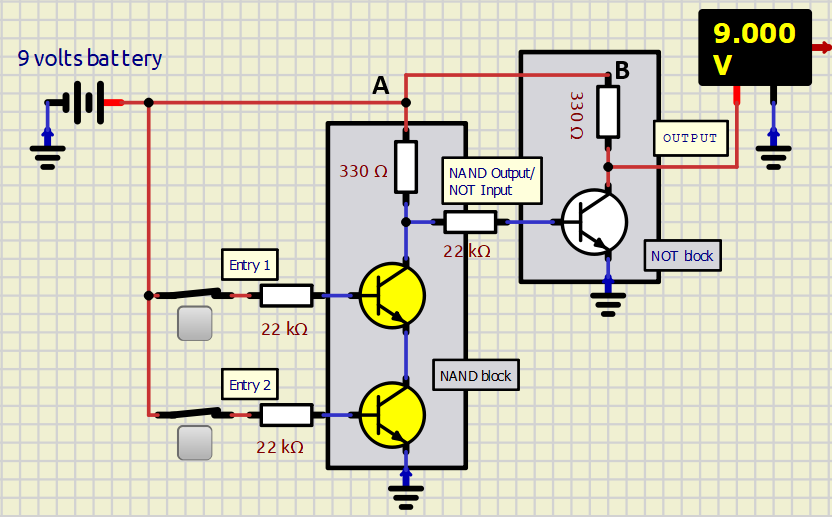
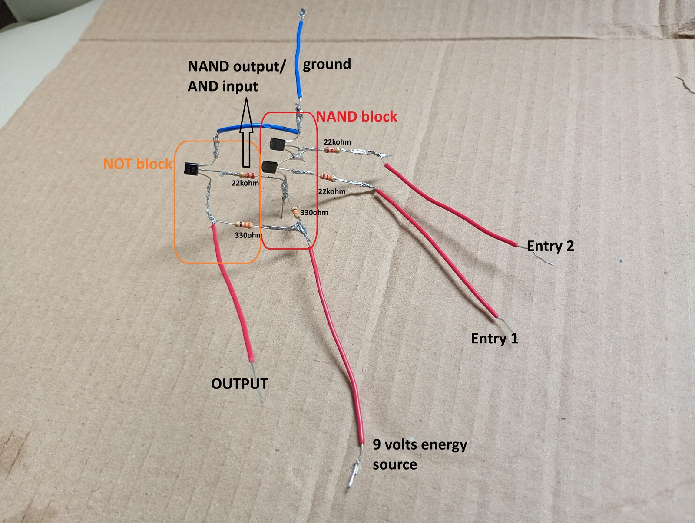
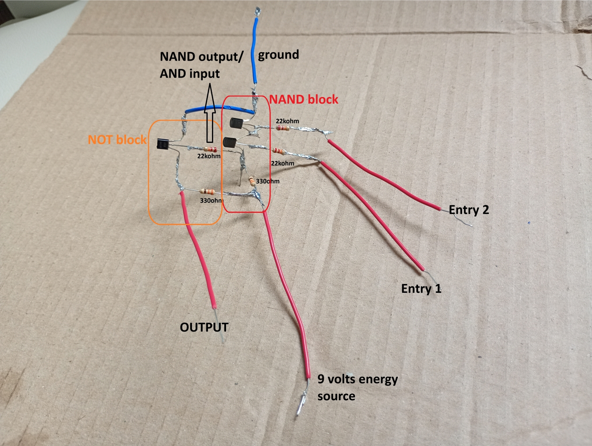
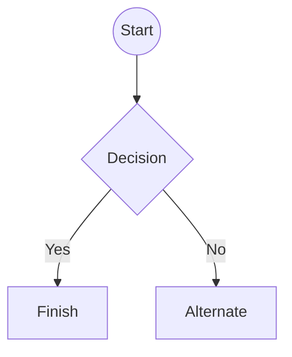

# 📖 **HANDBOOK**

# **1. Low-level logic circuits**

This is an introduction to the world of low-level logic circuits. But first things first, what are low-level logic circuits? 

## 1.1. Explanation of low-level logic circuits

### What is an eletronic circuit⚡?

#### The authors definition is

*"A circuit, or more specific, an eletronic circuit, is a combination of eletronic elements (such as resistors, transistors, capacitors and diodos) connected to each other to control de energy passing through them."*

#### Another definition would be from Wikipedia (2026)

*"An electronic circuit is composed of individual electronic components, such as resistors, transistors, capacitors, inductors and diodes, connected by conductive wires or traces through which electric current can flow. It is a type of electrical circuit. For a circuit to be referred to as electronic, rather than electrical, generally at least one active component must be present."*

### What does "Low-level" mean 🤖?

The "Low-level" term means, is this context, that no integrated circuit make part of the circuit, only the simpliest components, such as resistors, transistors and diodos. For better understanding of the term "integrated circuit", here is a quick explanaiton from website Synopsys:

*"An integrated circuit (IC) — commonly called a chip — is a compact, highly efficient semiconductor device that contains a multitude of interconnected electronic components such as transistors, resistors, and capacitors, all fabricated on a single piece of silicon. This revolutionary technology forms the backbone of modern electronics, enabling high-speed, miniaturized, and reliable devices found in everything from smartphones and computers to medical equipment and vehicles."*

### Conclusion 🏆

Finally, we put together all these definitions to form the final understanding of low-level logic circuits: its a eletronic circuit using only basic eletronic components to create a logic operator, such as AND, OR, NOT, NAND and NOR operators.

## 1.2. Assembly of the low-level logic operators circuits 🪄

### **AND Operator**

#### Truth table 

The (boolean) truth table for AND operator is the following:

| Entry 1 | Entry 2 | Output |
| ------- | ------- | ------ |
| false | false | **false** |
| true | false | **false** |
| false | true | **false** |
| true | true | **true** |

And the (eletronic) truth table is:

| Entry 1 | Entry 2 | Output |
| ------- | ------- | ------ |
| low | low | **low** |
| high | low | **low** |
| low | high | **low** |
| high | high | **high** |

where low state is 0 volts and high state (in this project) is 9 volts.

#### Logic behing assembly

One curious thing about assembling the AND operator (and later we will see that the same aplies to OR operator) is that it is never  actually build directly as a AND operator, but rather as a NAND + NOT operator. 

This is due to the nature of electricity. As explained earlier in the Transistor section, this eletronic element reduces the tension passing through it in 0.7 volts. In the AND operator, we need two transistors in series, wich reduces the tension of 9 volts to 7.6 volts. When this energy passes through another AND operator, it drops to 6.2 volts. In a complex system, it would eventually become 0 volts. 

This mid-state (of 7.6 volts) output that is in between low (0 volts) and high (9 volts) breaks the principle of low-high only states, making tiny errors (bugs) over the system, untils the system doesnt actually work. To overpass this, as explained earlier, the AND operator is assembled as NAND + NOT operators, where the transistors are no longer responsable for creating a path for the current to exit the system, but controling when this current will go to the ground. Below there is an example of the raw AND operator and its form as NAND + NOT.




So, thats why the AND operators in this project are build with the NAND + NOT schema. Now, lets talk about the principle of working of this circuit. Below, there are the four combinations of entries in this AND operator, showing the behavior of the current. To read the diagrams, keep in mind that the red wire means there is current, while blue means the oposite. Also, yellow transistor mean its saturated (current may pass through it) and white means its off (current cant pass through it).

##### Both entries are low



As we can see, when both entries are low, the output is also low (it is actually 0.1442 volts, but we can consider this as low). Seeing the current flow, we see that the transistors of the NAND block are not saturated (didnt activate). This implies that the current comming from point A cannot go through them. The only other way for the current is the NOT Input way. As a result, the transistor of the NOT block become saturated, and the current from point B is able to pass through it, going right to the ground point. Finally, we see that the current from point B doesnt go to the OUTPUT due to the extremely low resistance in the NOT block's transistor, resulting in a low OUTPUT. 

##### First entry is high and the second is low



If the first entry is high and the second is low, the output is low. With the current flow its possible to see the similarity with the previous cenario. Although the first entry is high, the second one still on low. This makes impossible for the current comming from A to pass through the two transistors in the NAND block. This make the rest of the analysis identical to the *both entries on low* cenario.

>*Someone might be asking now: "why the first transistor from the NAND block didnt saturated (you can see it is not yellow as the NOT's transistor) if its entry is turned on?"*. 
><br>Well, the answer is simple: to a transistor to saturate, there must be current in its base. And to exists current in a system, there must be a way of this current "finding" the 0 volts point. Imagine the current as the movement of atoms. If there is a point of entry, but no way out, they will fill up the room, but then there will be no more movement, because they will be stuck. And if they dont move, there is no current. In this cenario, they cant move because the other transistor is not saturated, making impossible for the current in the base reach the 0 volts point.

##### First entry is low and the second is high



When the first entry is low and the second is high, the output is also low. The ideia is the same as the preceding cenario. Because only the second transistor in the NAND block is saturated, the current comming from A cannot pass through both these transistors. 

##### Both entries are high



This cenario is the only one wich the OUTPUT is high. Because both entries are high, the two transistors in the NAND block become saturated. This allows the current comming from point A to pass through these transistors and go to the ground point without going to the NOT input path. This keeps the NOT's transistor closed, wich blocks the current from B to pass through it. And then, the only other way for this current is the OUTPUT.

#### Components

Each AND operator in the project is composed of

* 3x 22k Ohm 1/4W carbon resistors
* 2x 330 Ohm 1/4W carbon resistors
* 3x Transistor NPN BC-548

Beyond these components, the AND operator requires

* Two entries with 9 volts in High state/ 0 volts in Low state
* Fixed 9 volts energy source 


#### AND operator assembled (ignore my poor weld, im still learning how to do it 🤓)




## Headers

# This is a Heading h1
## This is a Heading h2
###### This is a Heading h6

## Emphasis

*This text will be italic*  
_This will also be italic_

**This text will be bold**  
__This will also be bold__

_You **can** combine them_

## Lists

### Unordered

* Item 1
* Item 2
* Item 2a
* Item 2b
    * Item 3a
    * Item 3b

### Ordered

1. Item 1
2. Item 2
3. Item 3
    1. Item 3a
    2. Item 3b

## Images


## Links

You may be using [Markdown Live Preview](https://markdownlivepreview.com/).

## Blockquotes

> Markdown is a lightweight markup language with plain-text-formatting syntax, created in 2004 by John Gruber with Aaron Swartz.
>
>> Markdown is often used to format readme files, for writing messages in online discussion forums, and to create rich text using a plain text editor.

## Tables

| Left columns  | Right columns |
| ------------- |:-------------:|
| left foo      | right foo     |
| left bar      | right bar     |
| left baz      | right baz     |

## Blocks of code

```
let message = 'Hello world';
alert(message);
```

## Mermaid diagrams


## Inline code

This web site is using `markedjs/marked`.
