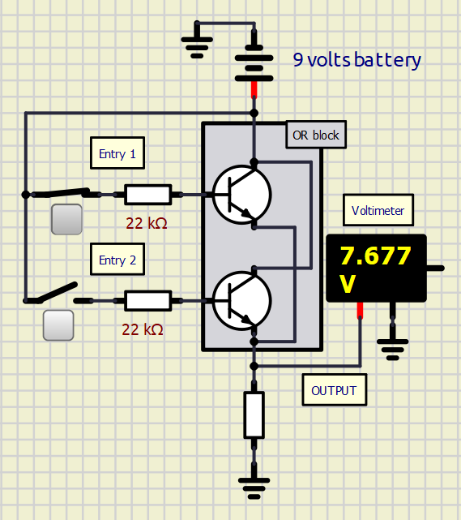
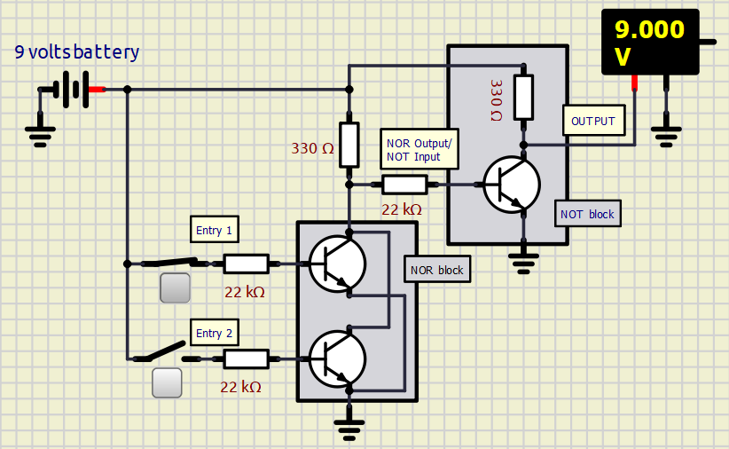
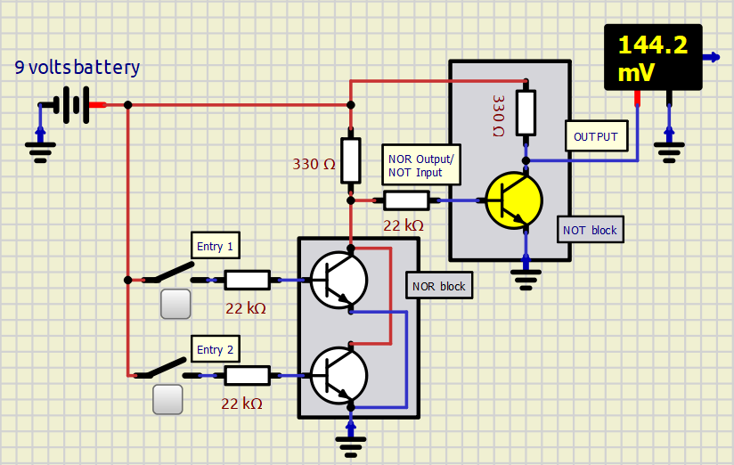
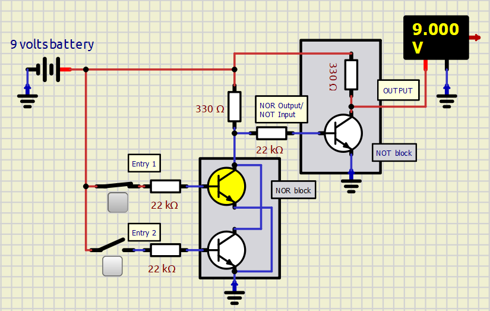
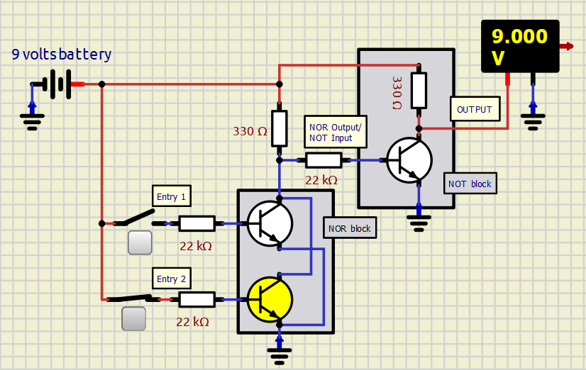
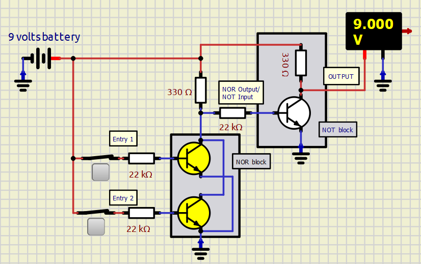
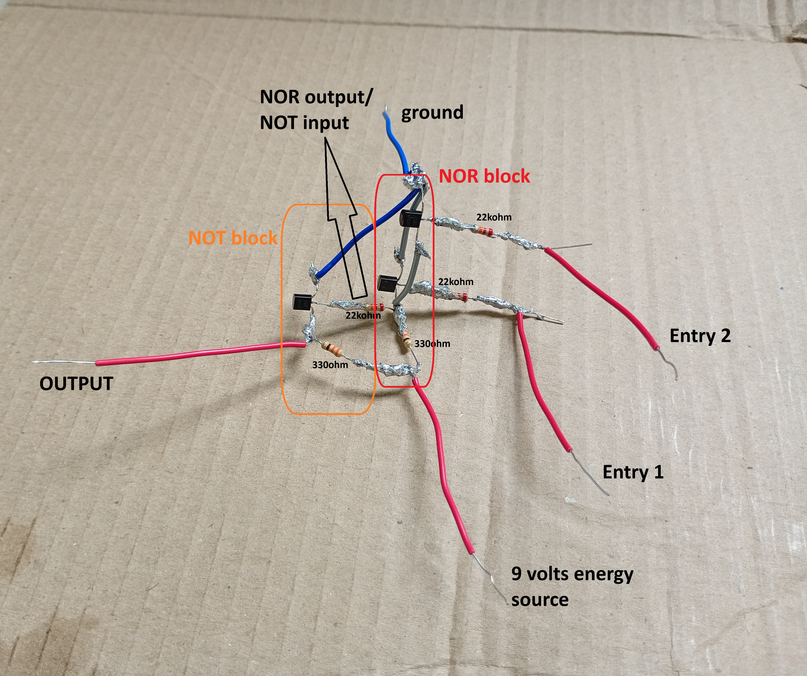
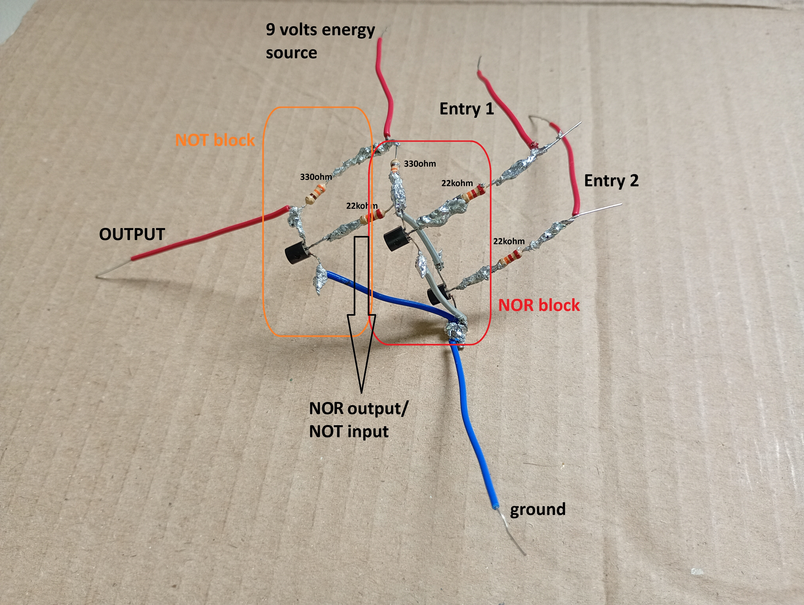

# **OR Operator**

## 0️⃣1️⃣ 1. Truth Tables
The OR operator yields a high state ($9\text{V}$) when some (1 or more) input signal is high.

| Entry 1 | Entry 2 | Boolean Output | Voltage Output |
| :---: | :---: | :---: | :---: |
| Low | Low | **False** | $\approx 0\text{V}$ |
| High | Low | **True** | **$9\text{V}$** |
| Low | High | **True** | **$9\text{V}$** |
| High | High | **True** | **$9\text{V}$** |

---

## 🧠 2. Engineering Logic & The "0.7V Voltage Drop" Problem
A naive approach would implement the OR operator by placing two NPN transistors in parallel. 
> 

However, the same **Voltage Drop** problem seen in the AND operator appears.

### 🛡️ The Solution: NOR + NOT Topology
To eliminate signal degradation, the OR gate is engineered by combining a **NOR block** with an inverting **NOT block**. In this architecture, the logic inputs do not carry the output load; instead, they merely route control current to the ground, maintaining a clean $9\text{V}$ or $0\text{V}$ rail-to-rail digital state.

> 

🔻 The downsides of this solution are basically more complexity, more components (cost💲) and the bigger difficult to assemble the circuit.

---

## 📊 Circuit State Analysis 

Here is how the current behaves dynamically across the four entry combinations:

### a) Both Entries are LOW
* **Simulator image:**
>

* **Status:** Output is **LOW** ($\approx 0.14\text{V}$).
* **Behavior:** The NOR transistors remain un-saturated (switched off). Current from the main source cannot bridge to the ground via the NOR block, forcing it into the base of the NOT transistor. This saturates the NOT transistor, allowing the final output to go straight to ground.

### b) Entry 1 is HIGH / Entry 2 is LOW
* **Simulator image:**
>

* **Status:** Output is **HIGH**.
* **Behavior:** The upper transistor in the NOR block saturates with the current comming from its base. Because the NORs transistors are parallel, only one transistor saturated is necessary to open a clear path for the current go to ground. As consequence, the current doesnt go to the NOTs transistors base. The NOTs transistor doesnt saturate, and the current cant go to ground. The final output is HIGH.

### c) Entry 1 is LOW / Entry 2 is HIGH
* **Simulator image:**
>

* **Status:** Output is **HIGH**.
* **Behavior:** Mirroring the scenario above, the NORs bottom transistor allows the current to go to ground, wich doesnt active the NOTs transistor. In turn, the current passing throw NOTs block is blocked from going to ground. The only other way is the OUTPUTs cable.

### d) Both Entries are HIGH
* **Simulator image:**
> 

* **Status:** Output is **HIGH** ($9\text{V}$).
* **Behavior:** Both NOR transistors saturate, opening paths of least resistance directly to ground. This starvation cuts off the base current to the NOT transistor, turning it off. The main supply line is now forced entirely out to the **OUTPUT** terminal.

---

### 2.3. Bill of Materials 🛒

Each individual OR operator module requires the following discrete components:

* **3x** $22\text{k }\Omega$ ($1/4\text{W}$) Carbon Film Resistors
* **2x** $330\text{ }\Omega$ ($1/4\text{W}$) Carbon Film Resistors
* **3x** BC-548 NPN Bipolar Junction Transistors (BJTs)
* **2x** Switches 
* **1x** $9\text{V}$ VCC Source

---

### 2.4. Hardware Gallery (Soldering & Assembly) 🛠️

> 💡 *Note: Transitioning from a temporary breadboard layout to a permanent soldered PCB ensures minimal contact resistance and long-term circuit stability.*

| Top View | Bottom View |
| :---: | :---: |
|  |  |
