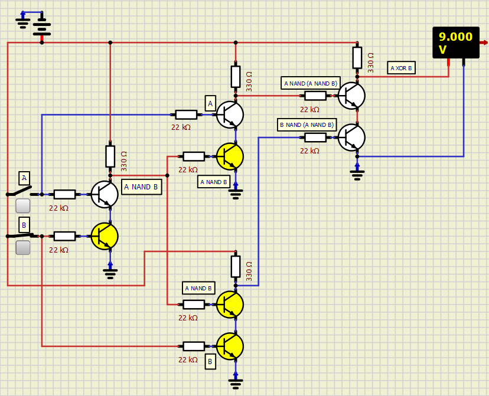
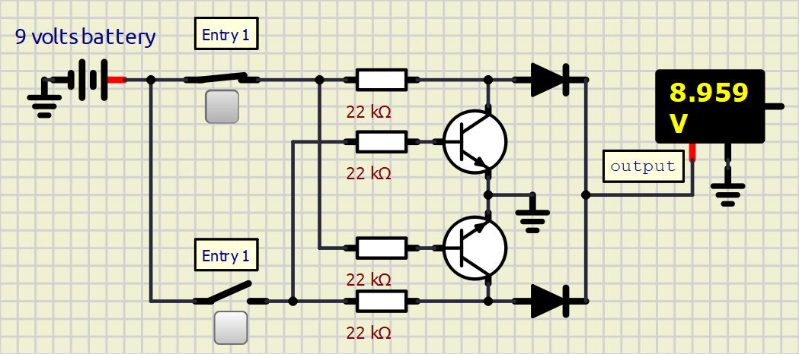
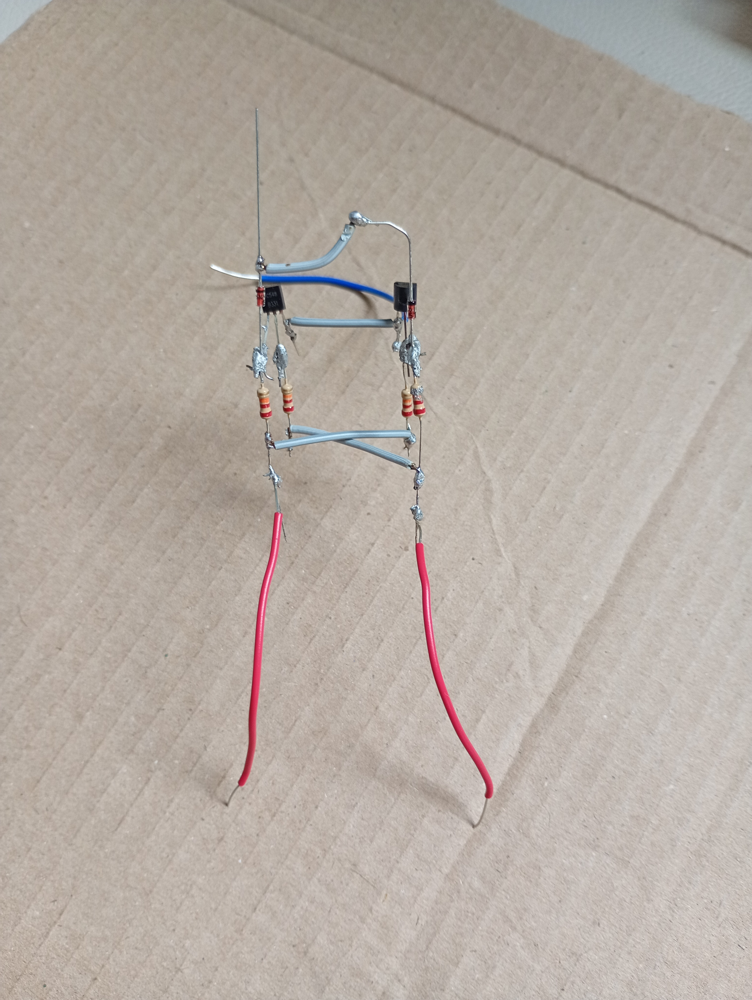
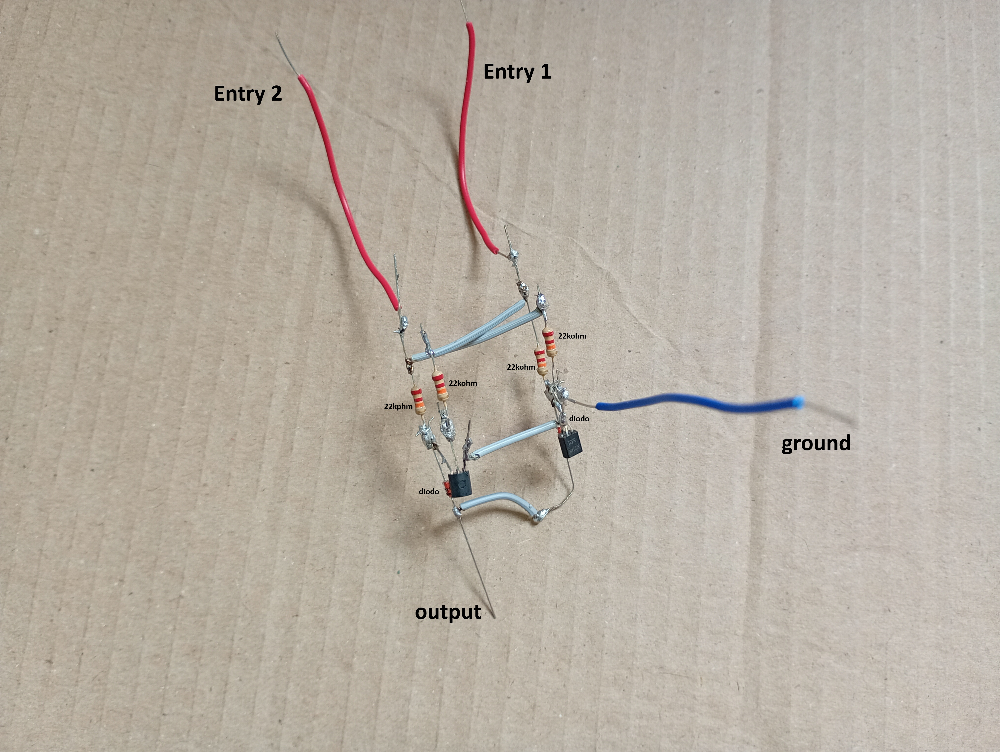

# ⚡ XOR Operator Module
> **Hardware Engineering Documentation** | *Logic Circuit Handbook*

---

## 📌 Overview
The XOR (Exclusive OR) logic operator outputs a High logic state (**9V**) **only** when both input signals are distinct from each other.

---

## 0️⃣1️⃣ Truth Table

| Input 1 (A) | Input 2 (B) | Boolean Output | Voltage Output |
| :---: | :---: | :---: | :---: |
| **Low** | **Low** | `False` | **≈ 0V** |
| **High** | **Low** | `True` | **9V** |
| **Low** | **High** | `True` | **9V** |
| **High** | **High** | `False` | **≈ 0V** |

---

## 🧠 Engineering Mathematical Logic

To construct an XOR boolean expression, the fundamental **AND**, **OR**, and **NOT** operators can be combined. Through the process of boolean synthesis, a *True* output occurs when: `(A AND NOT B) OR (NOT A AND B)`.

$$\text{A XOR B} = (A \cdot \neg B) + (\neg A \cdot B)$$

---

## 🔮 Boolean Expression for Physical Circuits

Now, we are going to analyze the boolean expression in order to turn it into possible real physical circuits. 
Analyzing the basic boolean expression of XOR reveals **5 logical operators**: 2 ANDs, 1 OR, and 2 NOTs.

We can simplify the physical circuit down to **4 operators** by restructuring the core logic to: *(Input A OR B is true) AND NOT (both inputs are true)*. This yields:

$$(A + B) \cdot \neg(A \cdot B)$$

### 🛠️ Refactoring via NAND & NOR

> 💡 **Design Note:** In transistor-level practical application, AND and OR gates are rarely built directly. Utilizing **NAND** and **NOR** gates is significantly more efficient and cost-effective.

1. **Starting Point:** $$A \cdot \neg B + \neg A \cdot B$$

2. **Expansion:** $$(A + B) \cdot (\neg A + \neg B) = A\cdot\neg A + A\cdot\neg B + B\cdot\neg A + B\cdot\neg B = 0 + A\cdot\neg B + B\cdot\neg A + 0$$

3. **Applying De Morgan's Theorem** ( $\neg(A + B) = \neg A \cdot \neg B$ ):
   $$(A + B) \cdot \neg(A \cdot B)$$

4. **Distributing the Term** $\neg(A \cdot B)$:
   $$A \cdot \neg(A \cdot B) + B \cdot \neg(A \cdot B)$$

5. **Applying De Morgan's Theorem Again:**
   $$\neg\left( \neg(A \cdot \neg(A \cdot B)) \cdot \neg(B \cdot \neg(A \cdot B)) \right)$$

> 🗣️ **Spoken Expression:**
> **[A NAND (A NAND B)] NAND [B NAND (A NAND B)]**

#### Advantages of the NAND Solution
* 🟢 **Universal Operator:** NAND gates are easy to assemble and lower in cost.
* 🟢 **Signal Reuse:** Although it appears to use 5 gates, the term `A NAND B` is reused, requiring only **4 physical NAND gates**.
* 🟢 **Low Transistor Count:** Uses only **8 transistors** (2 transistors per NAND gate).

---

### ⚡ Optimized Circuit with 2 Transistors

That is great news, but there is a catch even in this NAND solution. First, most projects use logic gate ICs to build logic operators instead of building them from individual transistors. But if logic gate ICs are used, there is no reason to create an XOR operator from NAND logic gates. That is because there are dedicated XOR logic gate ICs for the same cost as any other gate. That means you could waste $1 to make one XOR operator using NAND gates, or spend $1 to get 4 XOR operators using a proper XOR IC.

> So, when is the NAND solution useful?

Well, the first answer is *in projects that use discrete transistors*, and the second answer is *none*.
For projects that use transistors, one of the best ways to build an XOR operator is with NAND operators, since this can be done with no more than 8 transistors. 
If you are curious to know how this would look, here it is:
> 

But here comes the explanation for the second answer: you can build the XOR operator with only 2 transistors and 2 diodos. Here is how:

> 🔬 **Operating Principle:** When Input A is High, it deactivates Input B. When Input B is High, it deactivates Input A. The output remains High if and only if one input is active.

There are even other ways of implementing the XOR operator. For example, with 4 transistors and no diodes, and even with only 2 transistors and no diodes. But, for this project, the 2 transistors and 2 diodes configuration (as shown above) will be used.

---

## 📊 Dynamic Circuit State Analysis

### 🔴 a) Both Inputs LOW
* **Status:** Output **LOW** (**0V**)
* **Behavior:** With switches open, there is zero current circulation throughout the circuit.

### 🟢 b) Input 1 HIGH / Input 2 LOW
* **Status:** Output **HIGH** (**≈ 9V**)
* **Behavior:** Current flows directly from Input 1 to the output through the resistor and diode.

> ⚠️ **Attention:** Before passing through the **22kΩ** resistor, current splits at a node. A portion drives the base of the lower transistor, ensuring any stray incoming current from Input 2 is drained directly to ground (GND).

### 🟢 c) Input 1 LOW / Input 2 HIGH
* **Status:** Output **HIGH** (**≈ 9V**)
* **Behavior:** Symmetrical behavior to case (b).

### 🔴 d) Both Inputs HIGH
* **Status:** Output **LOW** (**≈ 0.03V**)
* **Behavior:** Input 1 turns on the transistor that drains Input 2, while Input 2 simultaneously turns on the transistor that drains Input 1. Both signals effectively cancel each other out relative to the output.

---

## 🛒 Bill of Materials (BOM)

| Component | Quantity | Specification |
| :--- | :---: | :--- |
| **Resistors** | `4x` | **22kΩ** (**1/4W**) Carbon Film |
| **Transistors** | `2x` | BC-548 NPN BJT |
| **Diodes** | `2x` | 1N4148 |
| **Switches** | `2x` | SPST / Push Button |
| **Power Supply** | `1x` | **9V** VCC |

---

## 🛠️ Hardware Gallery (Assembly & Soldering)

> 💡 **Assembly Tip:** Transitioning from breadboard to a soldered PCB guarantees lower contact resistance and superior long-term stability.

| Top View | Bottom View |
| :---: | :---: |
|  |  |