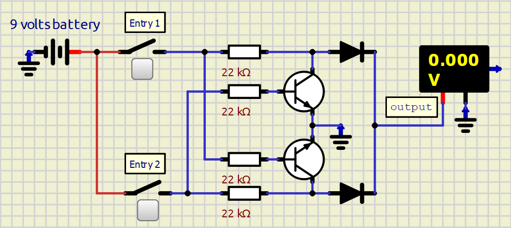
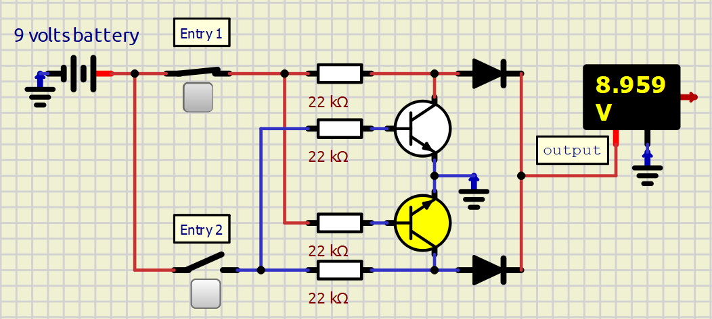
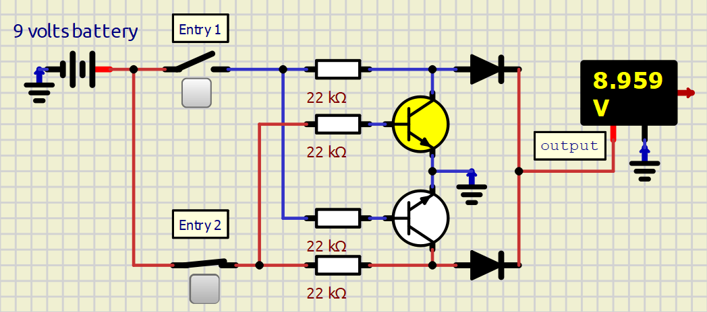
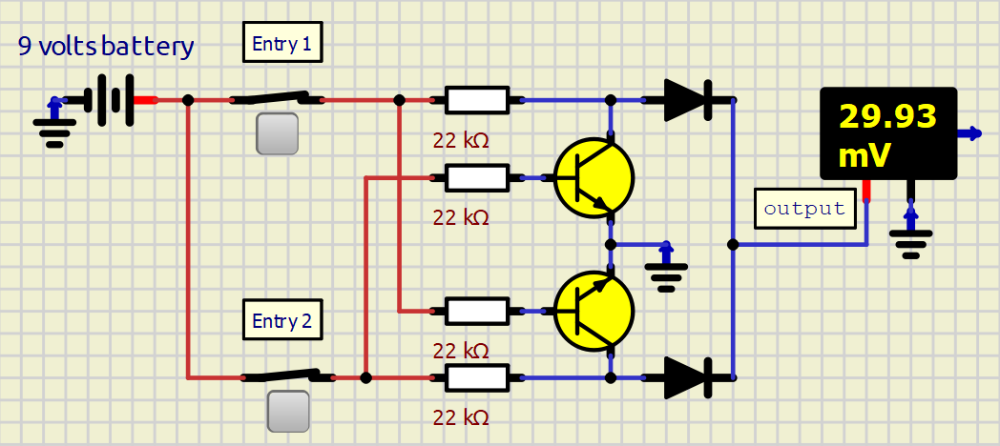

# **XOR Operator**

## 0️⃣1️⃣ 1. Truth Tables
The XOR operator yields a high state ($9\text{V}$) **only** when both input signals are distinct.

| Entry 1 (A) | Entry 2 (B) | Boolean Output | Voltage Output |
| :---: | :---: | :---: | :---: |
| Low | Low | **False** | $\approx 0\text{V}$ |
| High | Low | **True** | **$9\text{V}$** |
| Low | High | **True** | **$9\text{V}$** |
| High | High | **False** | $\approx 0\text{V}$ |

---

## 🧠 2. Engineering Math Logic

In order to create an XOR boolean expression, AND, OR, and NOT operators can be used.
Using the Boolean Synthesis process, the True output case happens when: (A AND NOT B) OR (NOT A AND B). In other terms, we have:

>### A XOR B = (A * !B) + (!A * B)

## 🔮 3. Mastering boolean expressions for a real physical circuit

Now we are going to analyze the boolean expression in order to turn it into possible real physical circuits. 
Analyzing the boolean expression of the XOR operator, there are 5 logic operators in it: 2 ANDs, 1 OR, and 2 NOTs.

First, we can reduce the number of operators to 4. We can do that by thinking of the XOR output being true when an entry is True (a simple OR), except when they are both true. This leads us to the expression (A OR B) AND NOT (A AND B), or simply (A + B) * !(A * B). 
This new XOR form needs only 4 operators: 1 OR, 2 ANDs, and 1 NOT.

Although it works logically, physically it is still not the best option. Let's see why:

> As we saw in the OR and AND operator documentation, we rarely build AND and OR operators directly as AND and OR operators. Instead, they are built as NAND + NOT and NOR + NOT operators (check those docs to understand better why). Naturally, it is better to build the XOR operator without using AND and OR operators directly, but rather using NAND and NOR operators. So, let's refactor the XOR boolean equation in terms of NAND and NOR:

We start with `A * !B + !A * B`  
We know that (A + B) * (!A + !B) = A*!A + A*!B + B*!A + B*!B = 0 + A*!B + B*!A + 0, which is the same expression as the line above. 
Now, applying De Morgan's theorem—which states *!(A + B) = (!A * !B)*—we transform (A + B) * (!A + !B) into (A + B) * !(A * B) *-- note that !(A * B) means A NAND B*. 
Distributing the !(A * B) term, we get (A + B) * !(A * B) = A * !(A * B) + B * !(A * B).  
Applying De Morgan's theorem one more time: A * !(A * B) + B * !(A * B) = !( !(A * !(A * B)) * !(B * !(A * B)) )

To make things clear, the "pronounceable" way to say *!( !(A * !(A * B)) * !(B * !(A * B)) )* is [A NAND (A NAND B)] NAND [B NAND (A NAND B)].  
That is much better than the simple form of *(A * !B) + (!A * B)*. Here is why:
1. Use of NAND: NAND is one of the universal logic operators, along with NOT and NOR. It is easier to assemble than a direct AND operator and costs less.
2. At first glance, this boolean expression uses 5 NAND operators. In reality, when assembling it, only 4 NAND operators are used. This is due to the repetition of the term *A NAND B*. 
3. Because NAND is one of the cheapest operators to build with transistors, the XOR solution using NAND is almost the cheapest and simplest one, needing only 8 transistors—two for each NAND.

That is great news, but there is a catch even in this NAND solution. First, most projects use logic gate ICs to build logic operators instead of building them from individual transistors. But if logic gate ICs are used, there is no reason to create an XOR operator from NAND logic gates. That is because there are dedicated XOR logic gate ICs for the same cost as any other gate. That means you could waste $1 to make one XOR operator using NAND gates, or spend $1 to get 4 XOR operators using a proper XOR IC.

> So, when is the NAND solution useful?

Well, the first answer is *in projects that use discrete transistors*, and the second answer is *none*.
For projects that use transistors, one of the best ways to build an XOR operator is with NAND operators, since this can be done with no more than 8 transistors. 
If you are curious to know how this would look, here it is:
> 

But here comes the explanation for the second answer: you can build the XOR operator with only 2 transistors. Here is how:

> The idea is actually simple: when entry A is high, it deactivates entry B. And when entry B is high, it deactivates entry A. This means the only way for the output to be High is when only one entry is High.

Below is the diagram where this idea is applied:

> 

There are other ways of implementing the XOR operator. For example, with 4 transistors and no diodes, and even with only 2 transistors and no diodes. But for this project, the 2 transistors and 2 diodes configuration (as shown above) will be used.

 
## 📊 Circuit State Analysis 

Here is how the current behaves dynamically across the four entry combinations:

### a) Both Entries are LOW
* **Simulator image:**
>

* **Status:** Output is **LOW** ($ 0 \text{V}$).
* **Behavior:** Because both entry switches are open, no current passes through the circuit. Thus, there is no output current.

### b) Entry 1 is HIGH / Entry 2 is LOW
* **Simulator image:**
>

* **Status:** Output is **HIGH** ($\approx 9\text{V}$).
* **Behavior:** As seen above, the current flows from entry 1 directly to the output, passing through a resistor and a diode. 

> ⚠️ Notice that before the current from entry 1 passes through the 22k ohm top resistor, it splits at a node. Part of the current goes to the output path, and the other part goes down to a transistor. This transistor, when activated, drains all the current coming from entry 2. In this case, entry 2 is open. But if there were energy coming from it, all of it would be drained directly to ground, never reaching the output.

### c) Entry 1 is LOW / Entry 2 is HIGH
* **Simulator image:**
>

* **Status:** Output is **HIGH** ($\approx 9\text{V}$).
* **Behavior:** Same idea as the previous scenario.

### d) Both Entries are HIGH
* **Simulator image:**
> 

* **Status:** Output is **LOW** ($\approx 0.03\text{V}$).
* **Behavior:** As discussed in case b), the entry 1 current activates the transistor that drains all the energy coming from entry 2. At the same time, the current from entry 2 activates the transistor that drains the energy coming from entry 1. In the end, both currents cancel each other out, putting the output in a LOW state.

---

### 2.3. Bill of Materials 🛒

Each individual XOR operator module requires the following discrete components:

* **4x** $22\text{k }\Omega$ ($1/4\text{W}$) Carbon Film Resistors
* **2x** BC-548 NPN Bipolar Junction Transistors (BJTs)
* **2x** 1N4148 Diodes
* **2x** Switches 
* **1x** $9\text{V}$ VCC Source

---

### 2.4. Hardware Gallery (Soldering & Assembly) 🛠️

> 💡 *Note: Transitioning from a temporary breadboard layout to a permanent soldered PCB ensures minimal contact resistance and long-term circuit stability.*

| Top View | Bottom View |
| :---: | :---: |
|  |  |